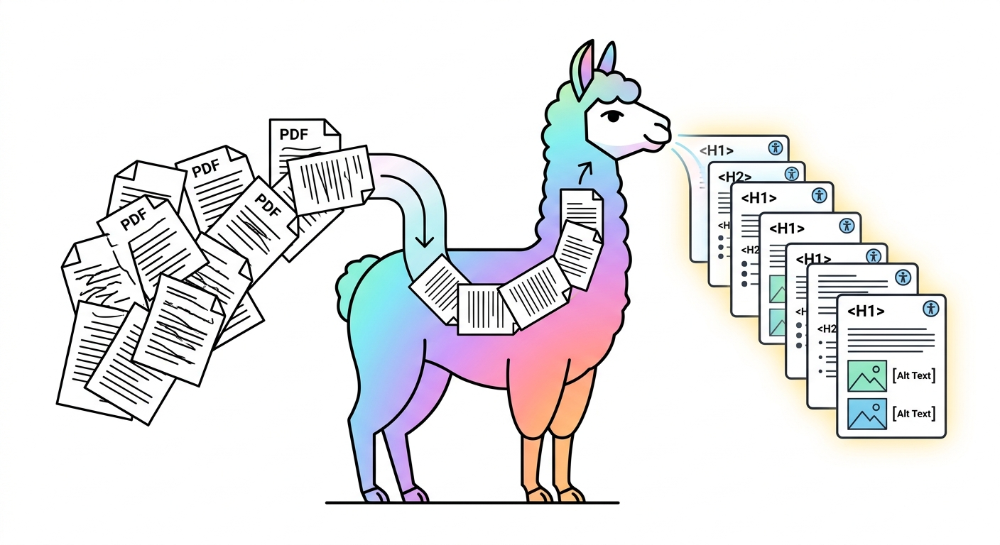

<div align="center">



# Documents to Accessible HTML

Convert inaccessible PDFs, PowerPoints, Word docs, and other documents to WCAG 2.1 AA compliant, screen-reader-compatible HTML — for less than half a cent per page.

Powered by [LlamaIndex](https://llamaindex.ai) / [LlamaParse](https://docs.cloud.llamaindex.ai/llamaparse/getting_started)

[](LICENSE)
&nbsp;&nbsp;
[](https://www.w3.org/WAI/WCAG21/quickref/)
&nbsp;&nbsp;
[](https://share.streamlit.io/beperron/pdf-to-accessible-html/main/app.py)

</div>

---

## The Problem

On **April 24, 2026**, the DOJ's [ADA Title II Digital Accessibility Rule](https://www.ada.gov/resources/2024-03-08-web-rule/) takes effect for every state and local government serving 50,000 or more people. For the first time, there is a legally binding technical standard — [WCAG 2.1 Level AA](https://www.w3.org/TR/WCAG21/) — for all digital content published by covered entities. The penalties are real: up to $75,000 for a first violation, $150,000 for subsequent violations, assessed per instance.

Most institutions understand their websites need to be accessible. Fewer have reckoned with the **document problem**.

> Public institutions produce and host enormous volumes of PDFs, PowerPoints, Word documents, and spreadsheets — court opinions, policy documents, research publications, meeting minutes, budget reports. The overwhelming majority are inaccessible. They lack tagged headings, meaningful reading order, table structure, and alt text. A screen reader encounters most of them as a wall of undifferentiated text — or worse, as images with no text at all.

Manual remediation costs $50–$150 per document and takes a trained specialist 10–15 hours. For an institution with thousands of documents, the math is prohibitive. This is why, despite decades of legal obligation, most public-facing documents remain inaccessible.

The new rule changes that calculus. This tool converts documents at $0.004 per page, and the free tier covers ~3,300 pages/month.

---

## Why This Exists

This is a **civil rights issue**, not a compliance issue.

Approximately 42.5 million Americans live with a disability that affects their use of digital content. When a court system publishes opinions as inaccessible PDFs, it is an access-to-justice failure. When a university posts research behind inaccessible formatting, it excludes the people that research is meant to serve.

The standards to fix this have existed since 1999. The ADA has been law since 1990. The publishers and institutions with the resources to implement them have chosen not to.

What has changed is that the technology to solve this is now available at a price point that makes the failure to act a choice rather than a constraint.

---

## Quick Start

**1. Get a free API key**

Sign up at [cloud.llamaindex.ai](https://cloud.llamaindex.ai) — takes 30 seconds, includes ~3,300 free pages/month.

**2. Use the web app**

```bash
pip install -r requirements.txt
streamlit run app.py
```

Upload your document, paste your API key, and click **Convert**. That's it.

**Or use the command line**

```bash
python convert.py presentation.pptx -k YOUR_API_KEY
```

Your accessible HTML will be in `./output/`.

---

## Usage

**Convert a single file** — pass any PDF, PowerPoint, Word doc, or other supported format:

```bash
python convert.py paper.pdf -k llx-...
python convert.py slides.pptx -k llx-...
python convert.py report.docx -k llx-...
```

**Convert a whole folder** — point it at a directory and everything inside gets converted:

```bash
python convert.py ./documents/ -o ./accessible/ -k llx-...
```

**Save your API key as an environment variable** so you don't have to type it every time:

```bash
export LLAMA_CLOUD_API_KEY=llx-...
python convert.py paper.pdf
```

### Options

| Flag | What it does |
|:---|:---|
| `input` | The file or folder you want to convert |
| `-o`, `--output` | Where to save the results (default: `./output`) |
| `-k`, `--api-key` | Your LlamaParse API key (or set `LLAMA_CLOUD_API_KEY`) |
| `-m`, `--mode` | Parsing quality: `fast`, `default`, or `quality` (see below) |

**Supported formats:** PDF, PPTX, DOCX, XLSX, RTF, EPUB, and images (JPG, PNG, TIFF, etc.). Anything [LlamaParse supports](https://docs.cloud.llamaindex.ai/llamaparse/getting_started).

Each document produces two output files: a `.html` (accessible, self-contained) and a `.md` (intermediate markdown). Every HTML file is audited against 8 WCAG 2.1 AA criteria on creation.

### Parsing Modes

The `--mode` flag controls how thoroughly [LlamaParse](https://docs.cloud.llamaindex.ai/llamaparse/getting_started) extracts content. Higher modes use more credits but produce better results on complex documents.

| Mode | Credits/page | Best for |
|:---|:---|:---|
| `fast` | ~3 | Simple, text-heavy documents |
| `default` | ~3–10 | Most documents. Auto-upgrades pages with tables or images. |
| `quality` | ~10 | Research papers, dense tables, equations, complex slide decks |

For most documents, `default` is the right choice. Use `quality` when structural accuracy really matters:

```bash
python convert.py paper.pdf -m quality -k llx-...
```

### Tested

All three modes have been tested across PDFs and PowerPoints. Every file passes the full 8-point WCAG 2.1 AA audit.

| Type | Mode | Pages | Time | Audit |
|:---|:---|:---|:---|:---|
| PDF | default | 168 | 334s | PASS |
| PDF | quality | 168 | 78s | PASS |
| PDF | default | 16 | 108s | PASS |
| PPTX | fast | 15 | 41s | PASS |
| PPTX | default | 8 | 63s | PASS |
| PPTX | quality | 30 | 74s | PASS |

---

## How It Works

```
Document  -->  LlamaParse API  -->  Structured Markdown  -->  5-Stage Pipeline  -->  Accessible HTML
```

Step 1 — Extraction via [LlamaParse](https://docs.cloud.llamaindex.ai/llamaparse/getting_started).
LlamaParse is a document parsing API built by [LlamaIndex](https://llamaindex.ai). It reads the document and extracts text, tables, equations, figures, and headings as structured markdown. This is the hard part — the step that would take a team of engineers months to build — and LlamaParse does it well, at scale, across PDFs, PowerPoints, Word docs, Excel files, and more.

Step 2 — Accessibility pipeline.
Five processors transform the markdown into WCAG-compliant HTML:

| Stage | What It Does |
|:---|:---|
| Math | Routes equations through MathJax for screen-reader navigation |
| Tables | Adds `<thead>`, `<th scope>`, `<caption>`, and ARIA roles |
| Figures | Wraps images in `<figure>` with `<figcaption>` and alt text |
| Headings | Repairs hierarchy (no skipped levels), adds slugified IDs |
| Accessibility | Skip links, ARIA landmarks, `lang` attribute, auto-generated TOC |

Step 3 — Audit.
Every output file is verified against 8 WCAG 2.1 AA criteria. Pass rate: 100%.

---

## What Makes the Output Accessible

<details>
<summary>Full accessibility feature list</summary>
<br>

| Feature | Why It Matters |
|:---|:---|
| Language attribute (`lang="en"`) | Screen readers use correct pronunciation |
| "Skip to content" link | Keyboard users jump past navigation |
| Landmark regions (`<main>`, `<nav>`, `<article>`) | Screen readers announce page structure |
| Auto-generated table of contents | Navigate to any section by heading |
| MathJax with accessibility explorer | Equations are spoken aloud and navigable |
| Semantic table markup (`<th scope>`, `<caption>`) | Screen readers announce row/column headers |
| Alt text on all images | Figures are described, not invisible |
| Sequential heading hierarchy | No confusing jumps in document structure |
| High-contrast styling (13.6:1 ratio) | Exceeds WCAG AA minimum (4.5:1) |
| Reduced motion support | Respects `prefers-reduced-motion` |
| Print stylesheet | Clean output when printed |

</details>

---

## Cost

| Tier | Cost | Pages |
|:---|:---|:---|
| Free | $0 | ~3,300 pages/month |
| Paid | ~$0.004/page | 10,000 pages = $50 |

> [!NOTE]
> You bring your own [LlamaParse API key](https://cloud.llamaindex.ai) from [LlamaIndex](https://llamaindex.ai). The free tier is generous — most individual users will never need to pay.

---

## Legal Context

Format conversion for accessibility is supported by multiple federal statutes and case law:

| Law | Relevance |
|:---|:---|
| ADA Title II (42 U.S.C. §§ 12131-12165) | Public entities must provide accessible digital content (WCAG 2.1 AA by April 2026) |
| Chafee Amendment (17 U.S.C. § 121) | Directly authorizes accessible format conversion for persons with print disabilities |
| Fair Use (17 U.S.C. § 107) | Educational, non-commercial format conversion for accessibility is a favored use |
| TEACH Act (17 U.S.C. §§ 110(2), 112(f)) | Authorizes format conversion for digital transmission to enrolled students |
| *HathiTrust* (755 F.3d 87, 2d Cir. 2014) | Federal appeals court held format conversion for accessibility is fair use — even for entire works |

---

## Limitations

> [!IMPORTANT]
> Automated conversion will produce occasional errors. Complex tables, unusual layouts, scanned images, and mathematical notation are common sources of imperfect output. Always review the output and compare against the original document. The original remains the authoritative source.

This tool dramatically reduces manual effort — from hours per document to seconds — but it does not eliminate the need for a final human review.

---

## Credits

This tool is 95% [LlamaParse](https://docs.cloud.llamaindex.ai/llamaparse/getting_started) and 5% post-processing. The extraction — the hard part — is entirely theirs.

- [LlamaIndex](https://llamaindex.ai) — the company behind LlamaParse. Their document parsing API is what makes this tool possible.
- [LlamaParse](https://docs.cloud.llamaindex.ai/llamaparse/getting_started) — the document extraction engine. Converts PDFs, PowerPoints, Word docs, and more to structured markdown with remarkable accuracy.
- [MathJax](https://www.mathjax.org/) — accessible equation rendering with the Speech Rule Engine.

---

<div align="center">

[Report an Issue](https://github.com/beperron/pdf-to-accessible-html/issues) · [Get an API Key](https://cloud.llamaindex.ai)

---

*Built because the publishers won't.*

*The legal discussion about whether you're allowed to do this costs 100x more than doing it.*

</div>
